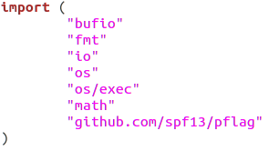
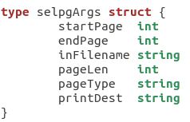
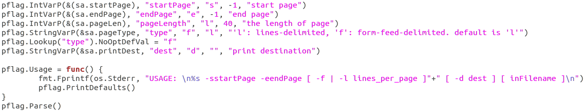
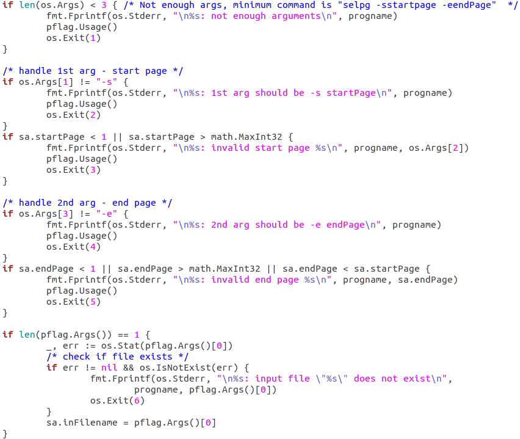
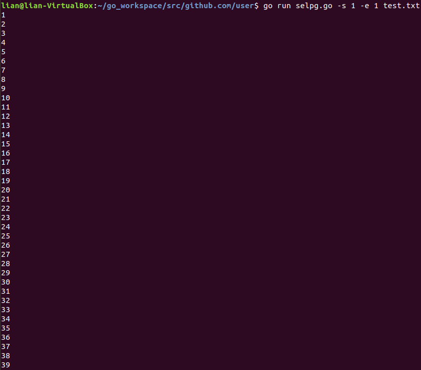
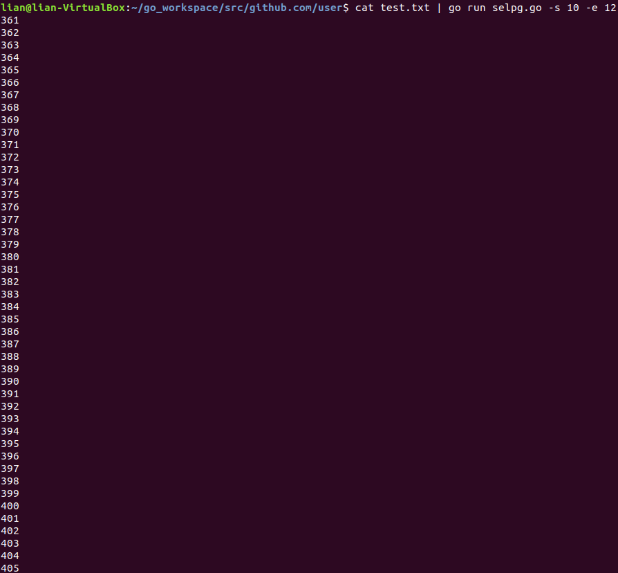
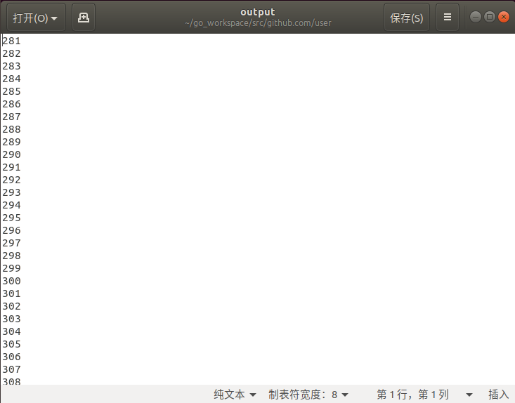

# CLI命令行实用程序开发基础
## 一、概述
  CLI（Command Line Interface）实用程序是Linux下应用开发的基础。正确的编写命令行程序让应用与操作系统融为一体，通过shell或script使得应用获得最大的灵活性与开发效率。Linux提供了cat、ls、copy等命令与操作系统交互；go语言提供一组实用程序完成从编码、编译、库管理、产品发布全过程支持；容器服务如docker、k8s提供了大量实用程序支撑云服务的开发、部署、监控、访问等管理任务；git、npm等都是大家比较熟悉的工具。尽管操作系统与应用系统服务可视化、图形化，但在开发领域，CLI在编程、调试、运维、管理中提供了图形化程序不可替代的灵活性与效率。
## 二、实验内容
  使用 golang 开发 [开发 Linux 命令行实用程序](https://www.ibm.com/developerworks/cn/linux/shell/clutil/index.html) 中的 **selpg**
## 三、设计说明
  先定义数据结构，如下图所示：
  
  
  
  
  
  利用pflag对命令行进行解析，获取需要的参数：
  
  
  
  获取参数后判断参数是否合理，若不合理则进行报错：
  
  
  
## 四、实验测试
  安装pflag库：
  使用命令：go get github.com/spf13/pflag
  建立一个测试文件“test.txt”，在文件中按顺序输入1~1500，每行只输一个数字。
  代码中定义了每页的行数为40，使用命令“go run selpg.go -s 1 -e 1 test.txt”可将第一页的内容输出。
  
  
  
  使用命令“cat test.txt | go run selpg.go -s 10 -e 12”，将test.txt中第10页到第12页的内容输出。
  
  
  
  使用命令“go run selpg.go -s 8 -e 12 test.txt >output”将test.txt文件中第8行到第12行的内容输出到新建的output文件中。
  
  
  
  可以看到，selpg的功能基本正常。
